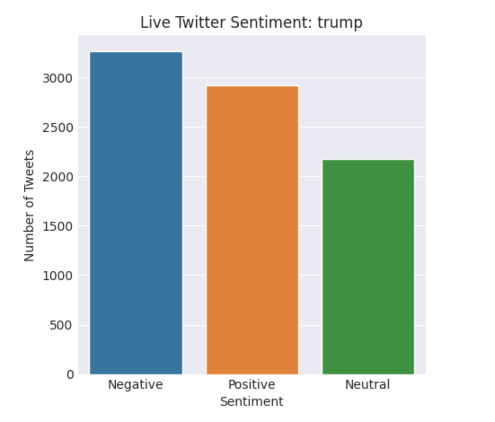
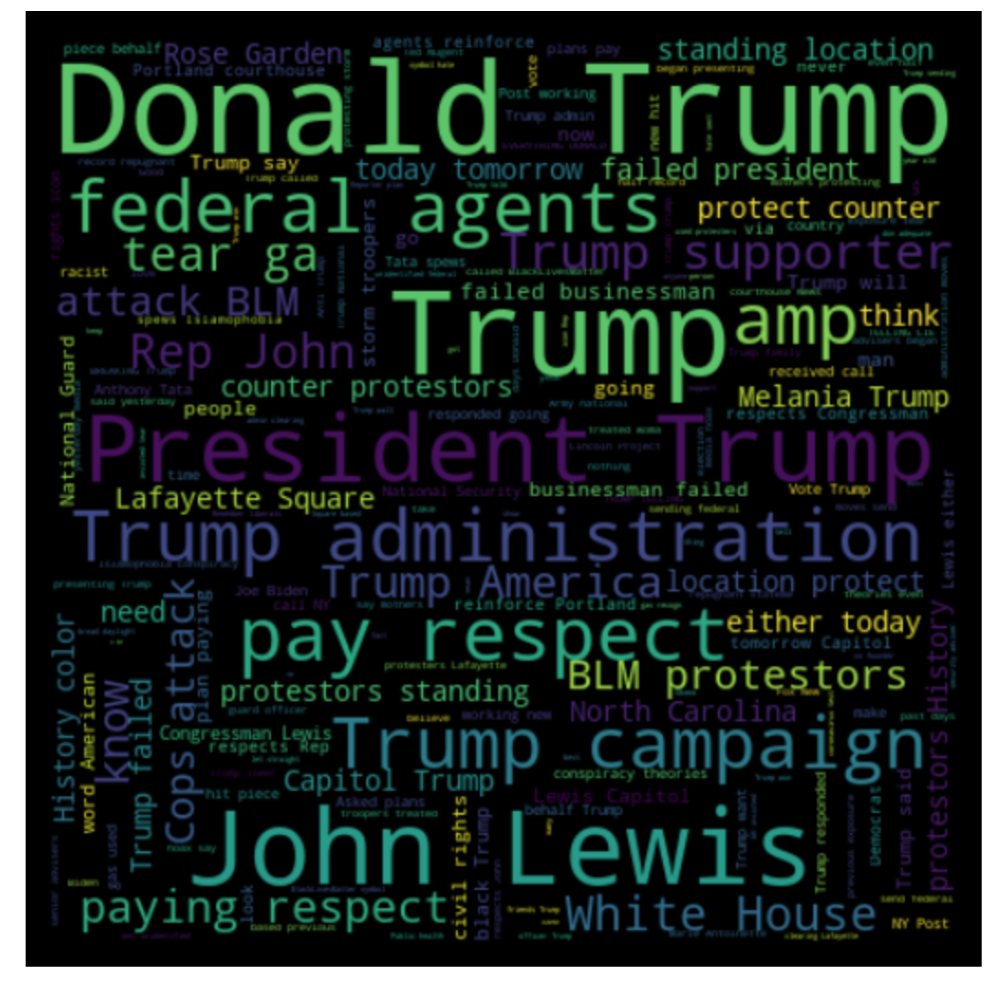
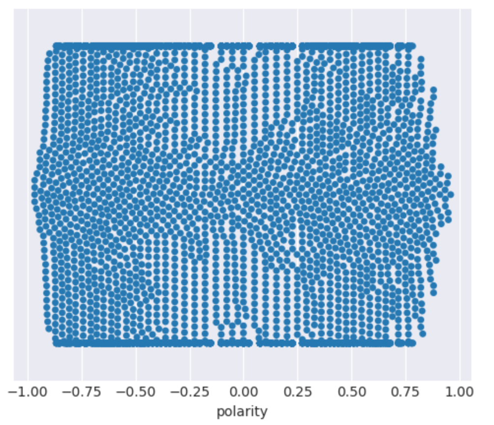

# Twitter_Sentiment_Analysis
Scrape live Tweets about the subject and perform sentiment analysis using VADER text sentiment model. The number of tweets categorized Positive, Negative or Neutral are plotted on a bar graph along with the word cloud of all the tweets. Additionally, a beeswarm plot of the polarity distribution of the tweets is displayed.

## Model Working:

For example, on Sentiment analysis of the subject "trump", all live tweets at the point of running the program with the word "trump" are fetched and stored in a DataFrame. Then the tweets are cleaned analysed using VADER to find polarity. The count of positive and negative tweets about the subject are visualized with a bar graph. Also, each tweet is plotted on a swarmplot based on their polarity with neutral tweets or polarity 0 tweets represented in the center of the plot. Also, a word cloud is generated to visualize the most common words in Tweets about the subject.

### Sentiment Chart 

### WordCloud

### Swarmplot of Tweets

